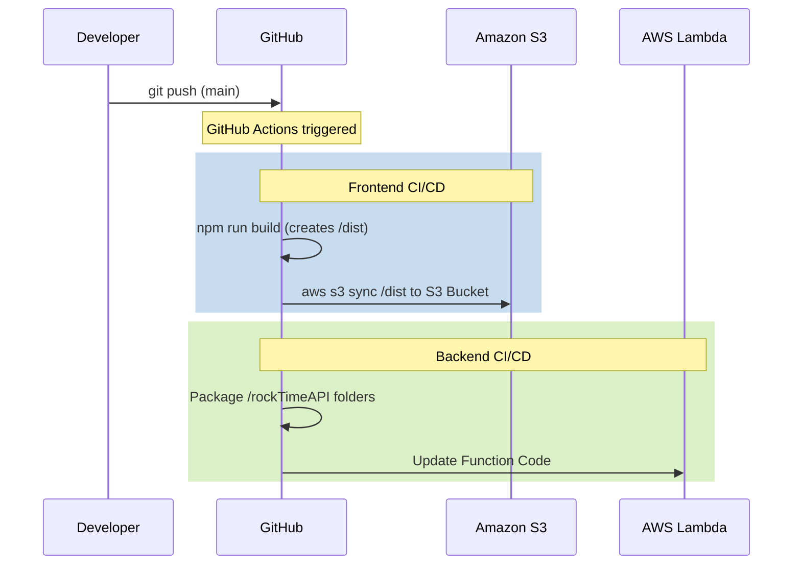

# RockTime Project Infrastructure & Architecture Guide

This document provides a comprehensive overview of the RockTime (formerly Showtime228) project's infrastructure, deployment processes, and architectural flow. 

## 🏗️ High-Level Architecture Diagram

The system follows a completely serverless infrastructure pattern on AWS, with decoupled frontend and backend layers, utilizing GitHub Actions for continuous deployment.

```mermaid
graph TD
    %% Users
    Client([👤 End User / Browser])
    Admin([👷 Developer / Admin])
    
    %% Frontend Layer
    Client -->|1. Request Static Files| S3_FE[(Amazon S3 \n Frontend Hosting)]
    Client -->|2. REST API Requests| APIGW[Amazon API Gateway]
    
    %% Application Layer (Lambda)
    subgraph "Serverless Compute Layer"
        APIGW -->|Routes to| L_User[Lambda: User Services]
        APIGW -->|Routes to| L_Event[Lambda: Event Services]
        APIGW -->|Routes to| L_Contact[Lambda: Contact/Comms]
        APIGW -->|Routes to| L_About[Lambda: About/Static info]
    end
    
    %% Database and Secrets
    subgraph "Data & Security Layer"
        L_User --> RDS[(Amazon RDS \n MySQL Database)]
        L_Event --> RDS
        
        L_User -.->|Get Credentials| SM[AWS Secrets Manager]
        L_Event -.->|Get Credentials| SM
    end
    
    %% Communication
    subgraph "Messaging & Communication"
        L_Contact --> SES[AWS SES \n Email Service]
        L_User --> SNS[AWS SNS \n Notifications]
        L_Event --> SNS
    end
    
    %% Monitoring
    subgraph "Monitoring Layer"
        L_User -.-> CW[Amazon CloudWatch]
        L_Event -.-> CW
        L_Contact -.-> CW
        APIGW -.-> CW
    end
    
    %% CI/CD Flow
    subgraph "CI/CD Pipeline (GitHub)"
        Admin -->|git push| GH[GitHub Repository]
        GH -->|Auto Deploy (Actions)| S3_FE
        GH -->|Auto Deploy (Actions)| L_User
        GH -->|Auto Deploy (Actions)| L_Event
        GH -->|Auto Deploy (Actions)| L_Contact
        GH -->|Auto Deploy (Actions)| L_About
    end
```

---

## 🛠️ Infrastructure Components Overview

The project relies heavily on AWS for a highly scalable, secure, and available environment. Here is a breakdown of the services in use:

### 1. Frontend & Hosting
* **Amazon S3**: Hosts the compiled static assets (HTML, JS, CSS) generated by React/Vite. The bucket is configured for static website hosting, delivering the user interface to web browsers.

### 2. Networking & Routing
* **Amazon API Gateway**: Acts as the single entry point for all backend data requests originating from the frontend app. It securely handles HTTP requests, throttles traffic if needed, and routes endpoints (like `/events`, `/users`) to their respective AWS Lambda functions.

### 3. Compute Layer
* **AWS Lambda**: Executes the backend business logic in a serverless manner. The backend codebase (located in the `rockTimeAPI` folder) is logically separated into micro-functions (e.g., `events`, `user`, `contact`, `about`). It automatically scales up or down depending on user traffic.

### 4. Database & Storage
* **Amazon RDS (MySQL)**: A fully managed relational database. It serves as the primary data store for the application, storing user information, event details, venue constraints, and ticketing/seat metadata seamlessly.

### 5. Security
* **AWS Secrets Manager**: Protects sensitive environment variables. Instead of hardcoding the RDS MySQL credentials or other API keys into the Lambda code, Lambda fetches these credentials dynamically at runtime to ensure maximum security.

### 6. Messaging & Notifications
* **AWS SES (Simple Email Service)**: Used by the application to send transactional emails. For example, processing contact forms, or sending ticket purchase confirmations/password resets to users.
* **AWS SNS (Simple Notification Service)**: Used for generic push messaging/notifications between application microservices or alert administrators of critical state changes.

### 7. Monitoring & Logging
* **Amazon CloudWatch**: The central nervous system for monitoring application health. All API Gateway execution logs and AWS Lambda console outputs feed into CloudWatch, alerting developers to errors, cold starts, and performance bottlenecks.

### 8. CI/CD & Version Control
* **GitHub (with GitHub Actions)**: Maintains the project source code and automates the release cycle. Actions defined in the `.github` directory handle continuous integration:
   * **Frontend Workflow:** Automatically builds the `dist` folder from the React app and syncs it to the AWS S3 bucket.
   * **Backend Workflow:** Automatically zips and pushes updates inside the `rockTimeAPI` folder directly to the designated AWS Lambda functions.

---

## 🚦 User Flow & Data Lifecycle

1. **Access Website:** The User opens their browser and navigates to the RockTime domain. The static React App is fetched from **Amazon S3**.
2. **Page Load Data Fetch:** As the app loads (e.g., the Events page), the React app fires an asynchronous HTTP request (`GET /events`) to the **API Gateway**.
3. **Execution & Authorisation:** API Gateway forwards the payload to the respective **AWS Lambda** function.
4. **Credential Retrieval:** The Lambda function authenticates against the database by retrieving the necessary connection credentials from **AWS Secrets Manager**.
5. **Data Fetching:** The Lambda function queries the **Amazon RDS (MySQL)** instance to retrieve the up-to-date events.
6. **Processing Actions:** 
   * If a user submits a contact form, the Lambda function executes and triggers **AWS SES** to dispatch an email.
   * Background anomalies and system prints are captured by **Amazon CloudWatch**.
7. **Response:** The data propagates back through API Gateway to the frontend, rendering the beautiful UI the user interacts with.

---

## 🔄 Deployment Lifecycle 

Nobody deploys locally. The deployment pipeline is entirely automated to ensure consistency:


